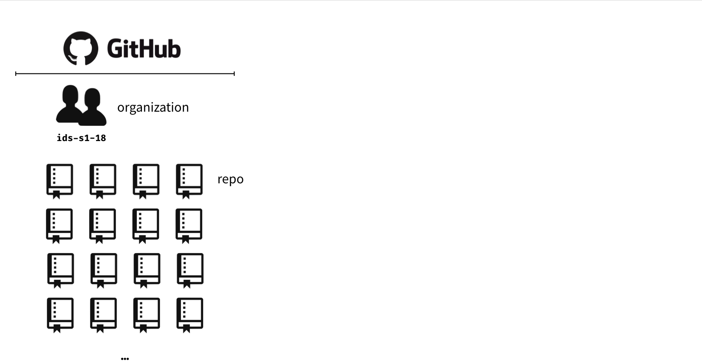
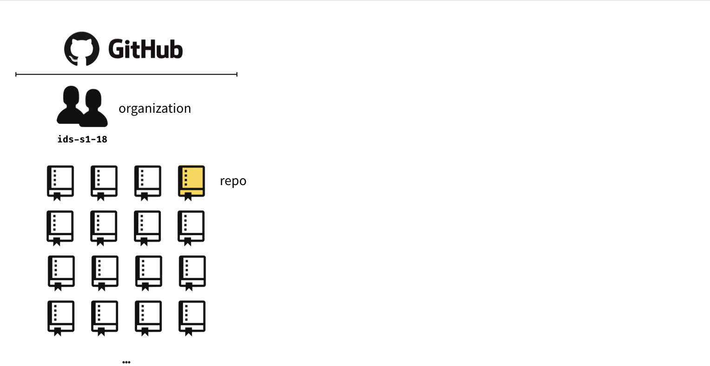
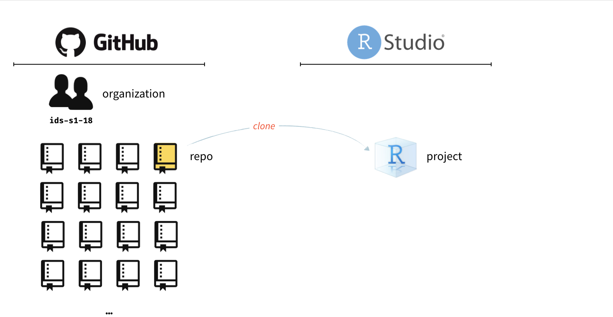
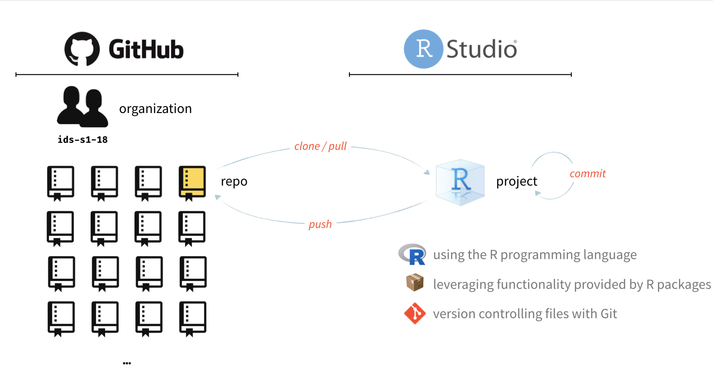

```{r child = "../setup.Rmd"}
```

```{r packages, echo=FALSE, message=FALSE, warning=FALSE}
library(tidyverse)
```


## So far this week...

- Hands on practice with R, RStudio, Git, GitHub
- First look at visualising and summarising data in R
- Why summary statistics alone are not sufficient for data exploration
- Clarifications requested:
  - One language: R
  - Teamwork: labs, project (assessed) + in class activities (suggested)
  - Student hours: Tue 14:30-16:30, questions/conversation
- And some of you still need to complete:
  - Syllabus review
  - Piazza sign up 
  - Getting to know you survey (deadline extended to tonight by 8pm!)

---

class: center, middle

.question[
.large[
Any questions?
]
]

---

class: center, middle

# Toolkit overview

---

```{r echo=FALSE, out.width="100%"}

```

---

```{r echo=FALSE, out.width="100%"}

```

---

```{r echo=FALSE, out.width="100%"}

```

---

```{r echo=FALSE, out.width="100%"}

```

---

class: center, middle

# The whole game

---

class: center, middle

### DEMO: Edinburgh Airbnb prices

---

class: center, middle

# R

---

## R

- R can be used as a calculator.
```{r}
8738787213 / 1653
```


- The most commonly used data type in R is data frames, where each row represents 
an observation, and each column a variable.

```{r}
mtcars
```

---

## R

- We use the `$` operator to access a variable within a data frame.

```{r}
mtcars$mpg
```

- Functions are (often) verbs, followed by what they will be applied to in parantheses.

```{r eval=FALSE}
do_this(to_this)
do_that(to_this, to_that, with_those)
```

---

## R

- In R, the fundamental unit of shareable code is the package.
- As of September 2019, there are over 14,000 packages available on the **C**omprehensive **R** **A**rchive **N**twork (CRAN), the public clearing house for R packages. 
- This huge variety of packages is one reason why R is so successful: the chances are that someone has already solved a problem that you’re working on, and you can benefit from their work by downloading their package.
- Using R packages:
  - Install them from CRAN with `install.packages("x")`.
  - Use them in R with `library(x)`.
  - Get help on them with package `?x` and `help(package = "x")`

---

class: center, middle

# RStudio

---

## RStudio

```{r echo=FALSE, out.width="80%"}
knitr::include_graphics("img/rstudio-anatomy.png")
```

---

class: center, middle

# R Markdown

---

## R Markdown

```{r echo=FALSE, out.width="100%"}
knitr::include_graphics("img/rmarkdown-anatomy.png")
```

---

## R Markdown tips

- Most importantly: environment of your R Markdown document is separate from that of the Console
- Help:
  - [R Markdown cheat sheet](https://github.com/rstudio/cheatsheets/raw/master/rmarkdown-2.0.pdf) 
  - Markdown Quick Reference (Help -> Markdown Quick Reference)

---

## How will we use R Markdown?

- Every assignment / report / project / etc. is an R Markdown document
- You'll always have a template R Markdown document to start with
- The amount of scaffolding in the template will decrease over the semester

---

class: center, middle

# Getting help in R

---

## Reading help files

```{r echo=FALSE, out.width="50%"}
knitr::include_graphics("img/r-help.png")
```

.tiny[
Source: http://socviz.co/appendix.html#a-little-more-about-r
]

---

## Asking good questions

- Always include your code and the error
- Create a minimum working example (we'll keep working on this throughout the semester)
- Use code formatting
